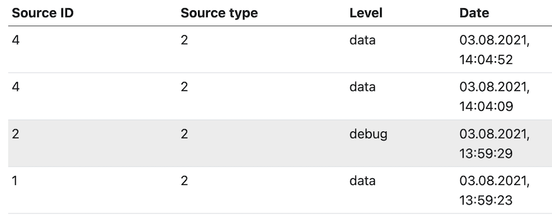
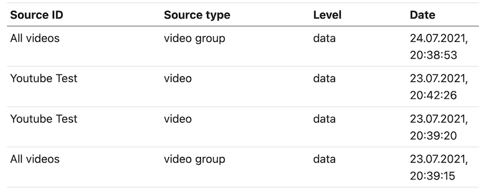

# Data provider

## Goal

In this bundle we only know the sourceID and the sourceType - but we don't know what these numerical values mean in your application.



Through a data provider, you can add this data during the display of the LogViewer.


## Create your own data provider

The template is [Svc\LogBundle\DataProvider\GeneralDataProvider](../src/DataProvider/GeneralDataProvider.php). This must be extended by your logic.

### Option 1

You overwrite the function getSourceTypeText and/or getSourceIDText. For a given sourceID or sourceType, the corresponding text is returned directly.

```php
use Svc\LogBundle\DataProvider\GeneralDataProvider;

class MyLogDataProvider extends GeneralDataProvider
 /**
   * get the text/description for a source type
   *
   * @param integer $sourceType
   * @return string
   */
  public function getSourceTypeText(int $sourceType): string
  {
    return "Type: " . strval($sourceType);
  }
```

### Option 2

You overwrite the function initSourceTypes and/or initSourceIDs and you define an array with all sourceTypes/sourceIDs

```php
  /**
   * init the sourceType array
   *
   * @return boolean
   */
  protected function initSourceTypes(): bool
  {
    if ($this->isSourceTypesInitialized) {
      return true;
    }
    $this->sourceTypes[VideoController::OBJ_TYPE_VIDEO] = "video";
    $this->sourceTypes[VideoController::OBJ_TYPE_VGROUP] = "video group";
    $this->isSourceTypesInitialized = true;
    return true;
  }
```

### Example

An example for both options you will find in the [DataProvider](https://github.com/Sven-Ve/svc-video-bundle/blob/main/src/Service/LogDataProvider.php) from svc/video-bundle.

## Config

In the yaml configuraton file you define, which Data Provider will be used:

```yaml
# config/packages/svc_log.yaml

svc_log:
    # Class of your own data provider to get info about sourceType and sourceID, see documentation
    data_provider: App\Service\MyLogDataProvider
```